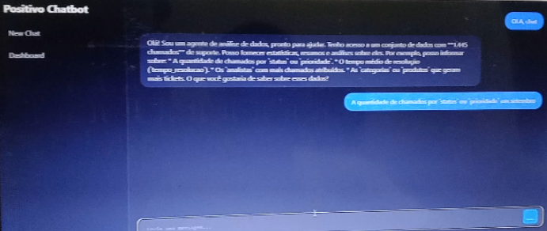
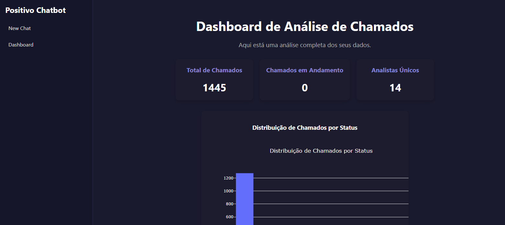

# 🤖 Chatbot Analista


---

## 🎯 O Problema

Em muitas operações de Service Desk, os dados ficam presos em bancos de dados complexos. Para extrair um relatório simples, o gestor depende de um analista que saiba escrever SQL ou precisa esperar exportações demoradas para planilhas. A informação existe, mas a barreira técnica dificulta o acesso.

---

## 💡 A Solução

Desenvolvi uma aplicação **RAG (Retrieval-Augmented Generation)** conectada a um banco de dados SQLite (`.db`). 

Ao contrário de sistemas que apenas leem planilhas, este bot atua como um **Engenheiro de Dados Virtual**:
1.  Ele entende a pergunta do usuário ("Quantos chamados críticos em Setembro?").
2.  Analisa a estrutura (schema) do banco de dados.
3.  **Escreve e executa uma query SQL** em tempo real.
4.  Interpreta o resultado e responde em texto ou gráfico.

### 📸 O Agente de IA
_Interface de chat onde o usuário conversa diretamente com o banco de dados._

<div align="center">
  
</div>

### 📊 Dashboard Executivo
_Visualização gráfica gerada a partir das queries automáticas._

<div align="center">
  
</div>

---

## 🛠️ Como Funciona (Arquitetura)

O sistema não "adivinha" respostas. Ele converte linguagem natural em sintaxe SQL válida.

```mermaid
graph LR
    User[👤 Usuário] -- "Pergunta: 'Qual analista fechou mais tickets?'" --> Frontend[⚛️ React Chat Interface];
    Frontend -- "API Request" --> Backend[🐍 Python API];
    Backend -- "Schema das Tabelas" --> AI_Engine[🧠 LLM Agent / SQL Chain];
    AI_Engine -- "Gera Query: SELECT name, count(*) FROM tickets..." --> Database[(🗄️ SQLite .db)];
    Database -- "Retorna Resultados" --> AI_Engine;
    AI_Engine -- "Resposta Explicativa" --> User;
